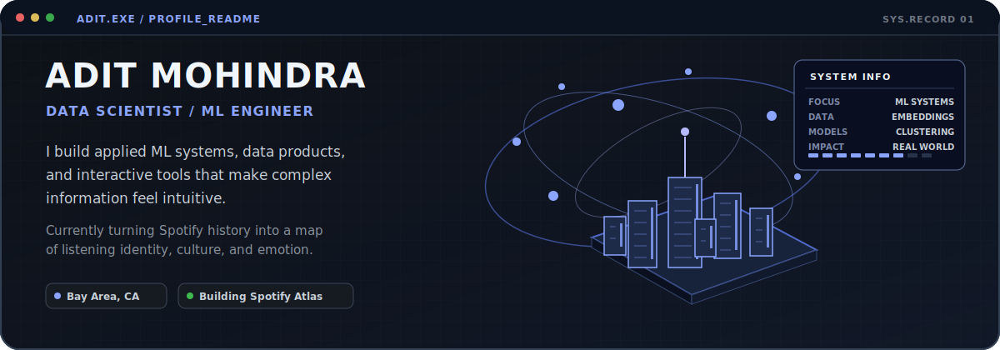
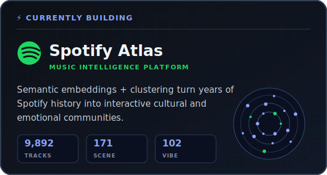
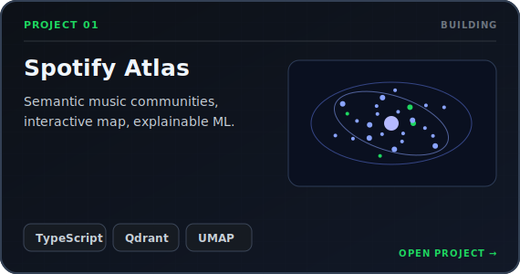
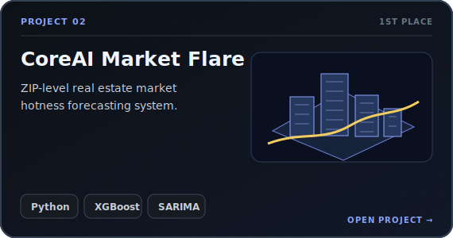
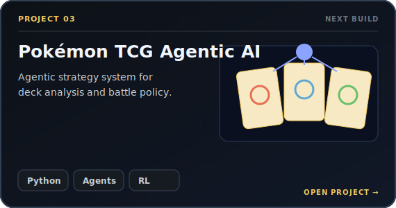
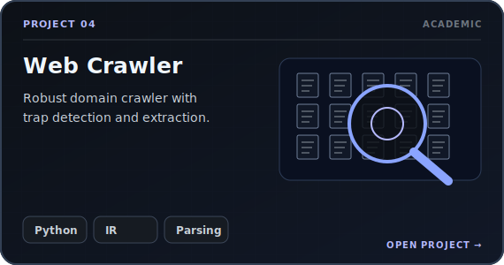
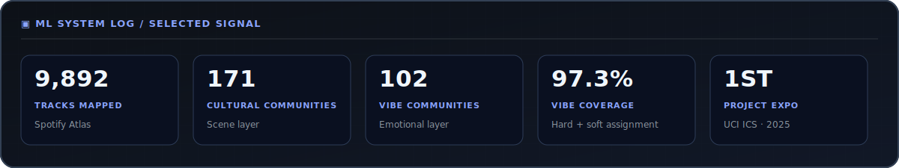
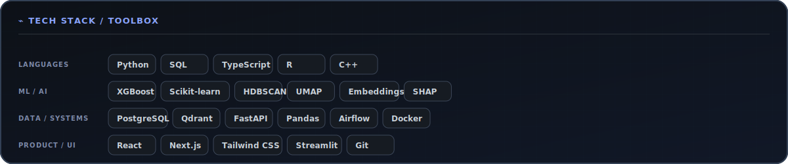
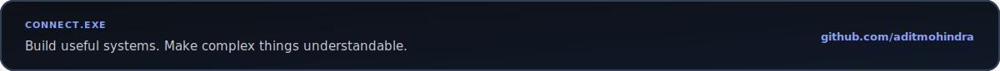

<!--
PROFILE README FOR: github.com/aditmohindra

QUICK EDITS:
1. Replace the portfolio URL near the bottom once your site is deployed.
2. Replace repository-search links with direct repository URLs as projects become public.
3. Keep all images inside ./assets so the README remains portable.
-->

  <picture>
    <source media="(prefers-color-scheme: light)" srcset="./assets/hero-light.svg">
    <source media="(prefers-color-scheme: dark)" srcset="./assets/hero-dark.svg">
    
  </picture>

<table>
  <tr>
    <td width="49%" valign="top">
      
    </td>
    <td width="51%" valign="top">
      <h3><code>ABOUT.EXE</code></h3>
      

        I am a Data Scientist and ML engineer focused on turning ambiguous real-world problems
        into reliable systems and intuitive products.
      

      

        My work spans predictive modeling, semantic embeddings, clustering, forecasting,
        backend systems, and interactive visualization.
      

      <ul>
        <li><strong>Current:</strong> building Spotify Atlas</li>
        <li><strong>Interested in:</strong> applied ML, AI products, music intelligence, and cool agentic systems</li>
        <li><strong>Based in:</strong> Bay Area, California</li>
      </ul>
      

        <a href="mailto:aditmohindra@gmail.com"><strong>Email</strong></a>
        ·
        <a href="https://www.linkedin.com/in/adit-mohindra"><strong>LinkedIn</strong></a>
        ·
        <a href="https://github.com/aditmohindra/portfolio-"><strong>Portfolio repository</strong></a>
      

    </td>
  </tr>
</table>

 

### `FEATURED_PROJECTS`

<table>
  <tr>
    <td width="50%">
      
    </td>
    <td width="50%">
      
    </td>
  </tr>
  <tr>
    <td width="50%">
      
    </td>
    <td width="50%">
      
    </td>
  </tr>
</table>

 

 

 

<table>
  <tr>
    <td width="50%" valign="top">
      <h3><code>HOW_I_BUILD</code></h3>
      <ol>
        <li>Frame the actual product or decision problem.</li>
        <li>Build the smallest defensible data and modeling pipeline.</li>
        <li>Evaluate behavior, failure modes, and user-facing usefulness.</li>
        <li>Ship the result as a system—not just a notebook.</li>
      </ol>
    </td>
    <td width="50%" valign="top">
      <h3><code>CURRENT_SIGNAL</code></h3>
      <ul>
        <li>Applied ML systems with measurable product value</li>
        <li>Embedding and clustering pipelines</li>
        <li>FastAPI + PostgreSQL + vector databases</li>
        <li>Interactive interfaces for complex model outputs</li>
      </ul>
    </td>
  </tr>
</table>

  <a href="mailto:aditmohindra@gmail.com"><strong>EMAIL</strong></a>
  &nbsp;·&nbsp;
  <a href="https://www.linkedin.com/in/adit-mohindra"><strong>LINKEDIN</strong></a>
  &nbsp;·&nbsp;
  <a href="https://github.com/aditmohindra"><strong>GITHUB</strong></a>
  &nbsp;·&nbsp;
  <a href="https://github.com/aditmohindra/portfolio-"><strong>PORTFOLIO REPO</strong></a>

